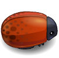

Frogger Clone
===============================

### Description
This is a simple arcade game which build on top of Object Oriented Javascript and HTML. 

### Rule
The goal for this game is actually really simple. All you need to do is trying to avoid bugs and the cute bear. At the 
same time, you need to collect gems to increase your score.

Your score will be reset to 0 if you die!

### How to Start
There are two simple steps to start the game.
 1. Download all the file in this directory.
 2. Open index.html in your favorite browser(IE, really?!) and enjoy your game. 

### Control
Arrow key : up, down, left and right

### Item
 +1 point
 +10 point

### Enemy: 
 

### Summary
This is a good practice for my JavaScript especially in Object Oriented JavaScript. I learn how to properly perform 
inheritance in JavaScript. I also learn how to use Canvas to draw images and perform animation.

The source code for this game is host at https://github.com/xian0831/frontend-nanodegree-arcade-game
